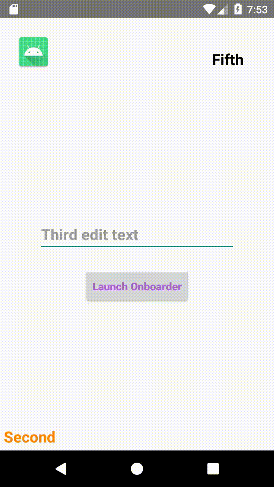

# Walk Through Onboarder Android Library

[](https://jitpack.io/#bolaware/Walk-Through-Onboarder)

Walk Through Onboarder is an android library that helps your users onboard by walking them step-by-step through important aspects of your app.

The library is based on anchoring of onboarding process around views(`ImageView`, `VideoView`, `ViewGroups` etc) in yout applications.

### Demo


Run the project's app and [Check out the way I used it in the my app's MainActivity](https://github.com/bolaware/Walk-Through-Onboarder/blob/master/app/src/main/java/com/bolaware/walkthroughguider/MainActivity.kt)

### Adding it to your project

**Step 1.** Add it in your root build.gradle at the end of repositories:

    allprojects {
		repositories {
			...
			maven { url 'https://jitpack.io' }
		}
	}

**Step 2.** Add the dependency

    dependencies {
	     implementation 'com.github.bolaware:Walk-Through-Onboarder:v1.0'
	}

### Initiate
You can checkout the sample app in the project, initiating Onboarder is as simple as this:

    WalkThroughDialog(
            this@MainActivity,
            listOf(
                AnchorView(
                    findViewById<TextView>(R.id.firstView),
                    "First View Description"
                ),
                AnchorView(
                    findViewById<TextView>(R.id.secondView),
                    "Second View Description"
                )
            )
        ).setAroundColor(R.color.transparentColor) //optional, advisable to make transparent
        .setContentTintColor(android.R.color.white) //optional
        .setHighLighterColor(android.R.color.white) //optional
        .setStepsPageIndicatorTextColor(android.R.color.darker_gray) //optional
        .show() //compulsory

### More
| function        | parameter           | type | required  |
| ------------- |:-------------:| -----:| -----:|
| setAroundColor(color)      |  This is the main background color of the dialog | `@ColorRes Int` | optional
| setContentTintColor(color)     | This is the color of the content of the dialog except for the page number text | `@ColorRes Int` | optional
| setHighLighterColor(color) | This is the color of the round highlighter that highlights the anchored view  | `@ColorRes Int` | optional
| setStepsPageIndicatorTextColor(color) | This is the text color for the page/steps number   | `@ColorRes Int` | optional
| show() | This is required to show the dialog |  | Required

### License
```
Walk-Through Onboarder Library
MIT License

Copyright (c) 2020

Permission is hereby granted, free of charge, to any person obtaining a copy
of this software and associated documentation files (the "Software"), to deal
in the Software without restriction, including without limitation the rights
to use, copy, modify, merge, publish, distribute, sublicense, and/or sell
copies of the Software, and to permit persons to whom the Software is
furnished to do so, subject to the following conditions:

The above copyright notice and this permission notice shall be included in all
copies or substantial portions of the Software.

THE SOFTWARE IS PROVIDED "AS IS", WITHOUT WARRANTY OF ANY KIND, EXPRESS OR
IMPLIED, INCLUDING BUT NOT LIMITED TO THE WARRANTIES OF MERCHANTABILITY,
FITNESS FOR A PARTICULAR PURPOSE AND NONINFRINGEMENT. IN NO EVENT SHALL THE
AUTHORS OR COPYRIGHT HOLDERS BE LIABLE FOR ANY CLAIM, DAMAGES OR OTHER
LIABILITY, WHETHER IN AN ACTION OF CONTRACT, TORT OR OTHERWISE, ARISING FROM,
OUT OF OR IN CONNECTION WITH THE SOFTWARE OR THE USE OR OTHER DEALINGS IN THE
SOFTWARE.
```
